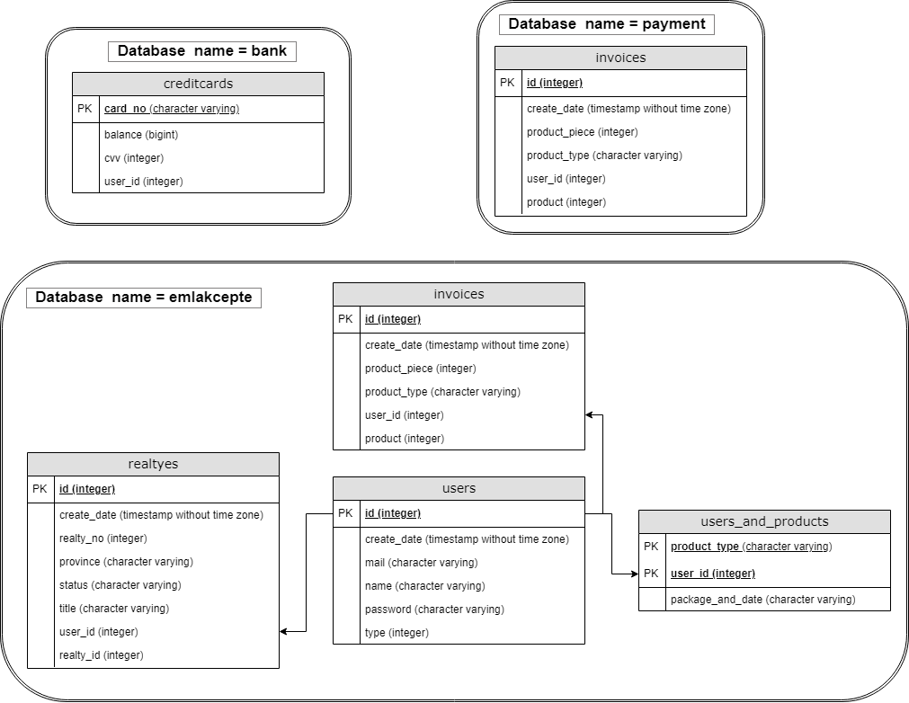
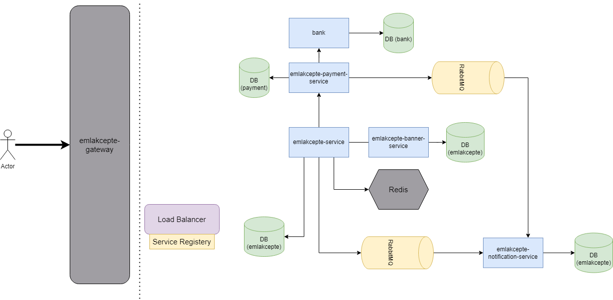

#### Gereksinimler;
Kullanıcılar aşağıdaki işlemleri gerçekleştirebilmelidir.
* İlan yayınlama sadece sisteme giriş yapan kullanıcı yapabilmeli
* Aktif ilanlarını görüntüleyebilmeli
* Pasif ilanlarını görüntüleyebilmeli
* Satın aldıkları paketleri(ürünleri) görebilmeli
* Kullanıcılar ilanları sadece ACTIVE ve PASSIVE statülerine güncelleyebilmeli
* Kullancıların aldıkları ürünler ödeme işlemi başarılı olduktan sonra
tanımlanmalı ve bu işlem asenkron yapılmalı

#### Sistem Kabulleri;
1. Ürünler, yukarıda belirtilen şekilde sistemde hali hazırda tanımlıdır. Ürün
   oluşturmak için yeni bir servis yazımına gerek yoktur. Sistem içerisinde
   tanımlanmaları yeterlidir.
2. Ürünler adet bazlı satılmaktadır.
3. Ürünler 10’ar adet olarak satın alınabilmektedir.
4. Ürünün geçerlilik 1 ay yani 30 gün ile sınırlıdır.
5. Ödeme işlemi için sisteme gerekli kayıtların yazılması yeterlidir.
6. Ödeme işlemi senkron yapılmalıdır.
7. İlanlar varsayılan olarak kaydedildiğinde IN_REVIEW statüsündedir. Asenkron
   olarak başka bir servis ACTIVE olarak değiştirmelidir.
8. Kullanıcılar ilanları sadece ACTIVE ve PASSIVE statülerine güncelleyebilir.

### Diagramlar

### Kullanılan Teknolojiler

	&nbsp;&nbsp;<a href="https://www.postgresql.org" target="_blank" rel="noreferrer"> &nbsp;&nbsp;  &nbsp;&nbsp; &nbsp;&nbsp; </a>

Java 8, Spring Boot, Restfull, Postgre, RabbitMQ, Microservice mimarisi
